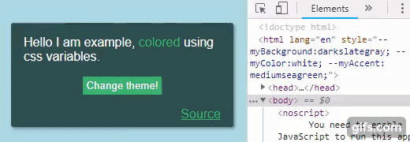

# react-css-vars [](https://travis-ci.org/karl-run/react-css-vars) [](https://www.npmjs.com/package/react-css-vars) [](https://github.com/karl-run/react-css-vars) [](https://www.codacy.com/app/karloveraa/react-css-vars?utm_source=github.com&utm_medium=referral&utm_content=karl-run/react-css-vars&utm_campaign=Badge_Grade)

A simple way to theme your React application using pure CSS variables.



## Why

Because CSS variables are fast. React doesn't have to lift a finger when the style changes globally.

## Can I use it

If you support modern browsers, you can use it!

Have a look at [caniuse.com](https://caniuse.com/#feat=css-variables) to make sure.

### Does it work with styled-components/emotion/glamor/glamorous?

Yes. As long as the browser supports CSS variables, then you should be able to use `var(--yourVariable)` in any CSS-in-JS library.

## Install

```bash
npm install react-css-vars
```

or

```bash
yarn add react-css-vars
```

## Basic usage

Simply import `ThemeSwitcher` and use it anywhere in your application, providing it a theme map.

```jsx
import React from 'react'

import ThemeSwitcher from 'react-css-vars'

const myTheme = {
  myColor: 'red',
}

class Example extends React.Component {
  render() {
    return <ThemeSwitcher theme={myTheme} />
  }
}
```

In your CSS you can use these variables.

```css
.anyCssClass {
  color: var(--myColor);
}
```

### Props 

##### ThemeSwitcher:
| Property      | Type          | Default             | Description |
| ------------- |:-------------:|:------------:       | ----------- |
| theme         | Object        | null                | **required** `{ key: value }`-map of variables and their values
| elementId     | string        | null                | used to apply the variables to a different element that `html`. The element is only referenced on component mount, so it needs to be a static DOM-node that doesn't change (i.e. probably not a React-element). Common use-case is the `#root` node that most React-apps renders into.

### Careful with multiple instances

This project writes the CSS variables directly to the `html` element (see the "How does it work" section for more details). So if you have two or more `ThemeSwitcher` in your application they might work against eachother.

However, you may have it anywhere in your application, it does not need to wrap your application like typical `Provider`-pattern type solutions do. You can use `ThemeSwitcher` without providing any children as well.

## Switching theme

To dynamically switch themes, simply provide a different theme as the `theme`-prop.

```jsx
import React from 'react'

import ThemeSwitcher from 'react-css-vars'

const myFirstTheme = {
  myColor: 'darkslategray',
}

const coolTheme = {
  myColor: 'yellow',
}

export default class App extends Component {
  state = {
    basicTheme: true,
  }

  handleToggleTheme = () => {
    this.setState(prevState => ({ basicTheme: !prevState.basicTheme }))
  }

  render() {
    const { basicTheme } = this.state

    return (
      <ThemeSwitcher theme={basicTheme ? basicTheme : coolTheme}>
        <div>
          <div>Example</div>
          <button onClick={this.handleToggleTheme}>Change theme!</button>
        </div>
      </ThemeSwitcher>
    )
  }
}
```

This is just a basic example on how to switch themes. As long as the `theme` prop changes, the theme is going to be applied.

## Overwriting CSS variables

If you would like to have your base theme in your CSS file, and only overwrite when the theme changes this is very simple.

In your CSS, provide your variables on the `:root`-pseudo-class

```css
:root {
  --myColor: palevioletred;
}
```

Then your switcher passes in `null` to the `ThemeSwitcher` when no theme is selected.

```jsx
import React from 'react'

import ThemeSwitcher from 'react-css-vars'

// Only one theme here, the base theme is declared in the CSS-file.
const coolTheme = {
  myColor: 'yellow',
}

export default class App extends Component {
  state = {
    basicTheme: true,
  }

  handleToggleTheme = () => {
    this.setState(prevState => ({ basicTheme: !prevState.basicTheme }))
  }

  render() {
    const { basicTheme } = this.state

    return (
      <ThemeSwitcher theme={basicTheme ? null : coolTheme}>
        <div>
          <div>Example</div>
          <button onClick={this.handleToggleTheme}>Change theme!</button>
        </div>
      </ThemeSwitcher>
    )
  }
}
```

For a full working example look at the [example](https://github.com/karl-run/react-css-vars/tree/master/example) project.

## How does it work

It's very simple! CSS variables are simply CSS properties that are assigned to a specific element. You can assign them to a psuedo-element known as `:root` like this:

```css
:root {
  --myVariable: palevioletred;
}
```

This library simply takes a map of values that look like this:

```js
const theme = {
  myVariable: 'red',
}
```

And simply sets them as CSS properties on the `html` element. Since this has higher precedence than the `:root` psuedo-element the browser will always select the programatically set values over the ones set on `:root`.

When the `theme`-prop changes, this library unsets the theme values that were previously set. If the `theme`-prop is set to null it will unset the previous values and not set any new ones. Any values on `:root` will then have the highest precedence again.

## License

MIT © [karl-run](https://github.com/karl-run)
